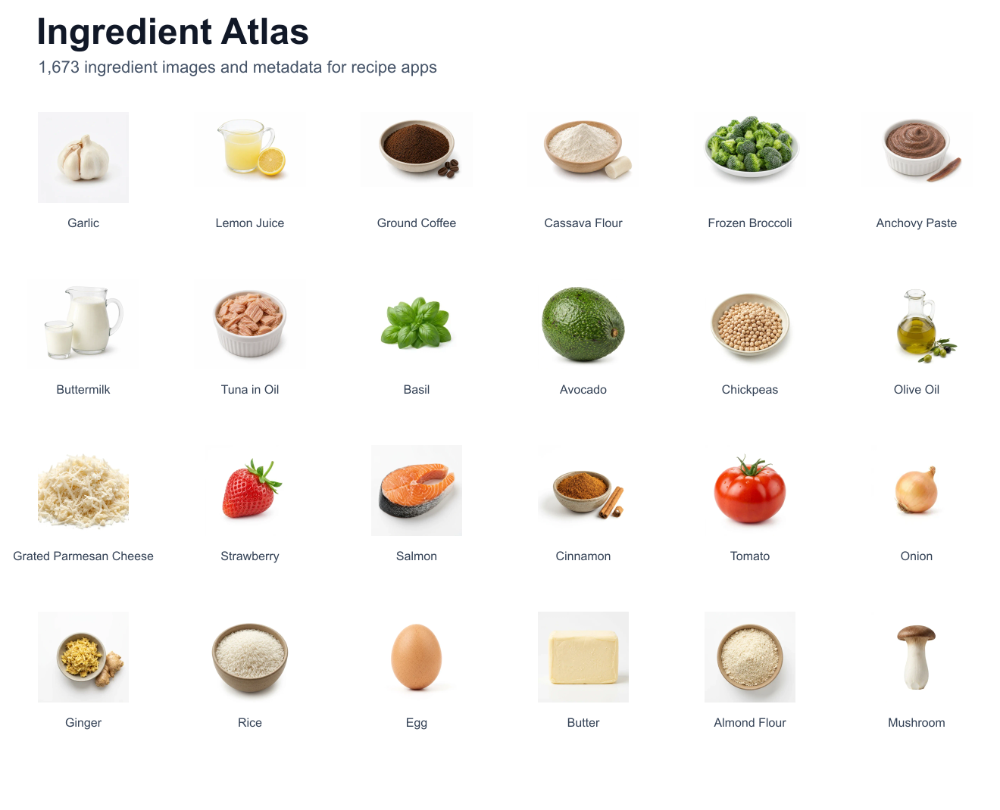

# Ingredient Atlas



Open ingredient images and metadata for recipe, grocery, pantry, and meal-planning apps.

I made this because recipe apps usually need a simple thing that is weirdly annoying to find: a clean image for garlic, lemon juice, cassava flour, frozen broccoli, and hundreds of other ingredients, with stable slugs and metadata attached.

Ingredient Atlas is incubated by Beets, but it is app-agnostic. You can use it without Beets, private services, or an API key.

Links:

- Dataset: https://huggingface.co/datasets/ionicam/ingredient-atlas
- npm: https://www.npmjs.com/package/ingredient-atlas
- Issues: https://github.com/ionmesca/ingredient-atlas/issues

## v0.1.2 Candidate Note

This branch includes a local v0.1.2 catalog expansion candidate with 20 food images, 5 food quantity-realism corrections, and a 20-item non-food pilot. Do not publish npm or update Hugging Face from this branch until the new derived image files and refreshed public manifests are uploaded together.

## What You Get

- 1,673 public v0 ingredient records
- 1,713 records in this local v0.1.2 candidate branch
- 5,019 public v0 image files
- 5,139 local v0.1.2 candidate image files after applying the batches
- WebP thumbnails and PNG fallbacks
- stable slugs, aliases, categories, checksums, and review status
- JSONL, Parquet, full manifest, and compact manifest
- public-safe metadata with internal IDs and prompts redacted

## Quick Use

Install the tiny resolver package:

```bash
npm install ingredient-atlas
```

Then resolve an ingredient to the public Hugging Face image files:

```js
import { getIngredientImage } from "ingredient-atlas"

const garlic = getIngredientImage("garlic", {
  baseUrl: "https://huggingface.co/datasets/ionicam/ingredient-atlas/resolve/main",
})

console.log(garlic.url)
```

Or use the dataset files directly from Hugging Face:

https://huggingface.co/datasets/ionicam/ingredient-atlas

## Catalog Helpers

The current public dataset is ingredient-first. The resolver also has catalog-named helpers so future records can include food, household, personal-care, and pet shopping items without changing the lookup shape:

```js
import { getCatalogItemImage } from "ingredient-atlas"

const garlic = getCatalogItemImage("garlic", { kind: "food" })
```

## Why This Is Different

Most food image datasets are for model training, dish classification, product labels, or nutrition research. Ingredient Atlas is for app builders. The images are isolated ingredient assets with metadata that is useful in UI.

## License

- Code: MIT
- Metadata: CC0-1.0
- AI-generated images: CC0-1.0

Release approvals are tracked in `docs/PUBLISHING.md`.

## AI And Nutrition Notes

Images are AI-generated and reviewed on a best-effort basis. They are useful, not perfect.

Nutrition metadata is best-effort ingredient metadata. Some values are USDA-backed, while others are approximate or missing. Do not use it as medical, allergy, or dietary advice.

## Corrections

Found a wrong image, wrong form, bad alias, or missing ingredient? Open a GitHub issue or email hello@ionmesca.com.

## Relationship To Beets

Ingredient Atlas was incubated by Beets. Beets supplied the starting taxonomy, image generation workflow, and review pipeline. Ingredient Atlas is meant to be useful to anyone building food software.
