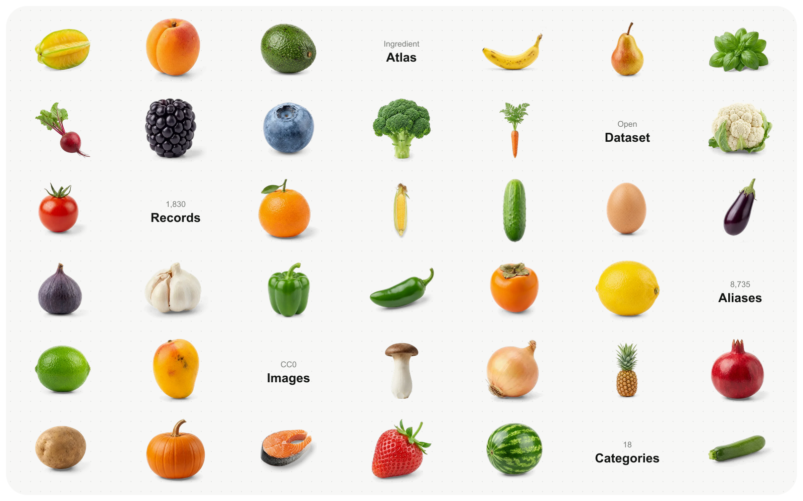

# Ingredient Atlas



Open ingredient and household catalog images for recipe, grocery, pantry, and meal-planning apps.

It is a dataset, not a service. 1,830 records, one per shopping-list item, each with a stable slug, a display name, a category, aliases, and three generated image files. Metadata and images are CC0-1.0. The resolver package that turns the string `garlic` into an image URL is MIT. Nothing here needs an account, an API key, or a running backend.

I made this because recipe apps usually need a simple thing that is weirdly annoying to find: a clean image for garlic, lemon juice, cassava flour, frozen broccoli, and hundreds of other ingredients, with stable slugs and metadata attached.

Ingredient Atlas is built and used by [Buna](https://heybuna.com), an open-source AI-native app that plans a household's food. Buna is app-agnostic about the atlas, and you can use the atlas without Buna.

Links:

- Dataset: https://huggingface.co/datasets/ionicam/ingredient-atlas
- npm: https://www.npmjs.com/package/ingredient-atlas
- Issues: https://github.com/ionmesca/ingredient-atlas/issues

## What you get

- 1,830 catalog records across 18 categories and 157 subcategories
- 5,490 image files: for each record, a source WebP, a WebP thumbnail, and a PNG fallback
- 8,735 aliases, many of them not English. `aglio`, `ail`, `ajo` and `knoblauch` all resolve to `garlic`; `aubergine` lands on `eggplant`, `courgette` on `zucchini`
- food, household, personal-care, and pet shopping item coverage
- stable slugs, categories, SHA-256 checksums, and review status on every image
- JSONL, Parquet, full manifest, and compact manifest
- public-safe metadata with internal IDs and prompts redacted

## Quick use

Install the tiny resolver package:

```bash
npm install ingredient-atlas
```

Then resolve an ingredient to the public Hugging Face image files:

```js
import { getIngredientImage } from "ingredient-atlas"

const garlic = getIngredientImage("garlic", {
  baseUrl: "https://huggingface.co/datasets/ionicam/ingredient-atlas/resolve/main",
})

console.log(garlic.url)
```

Or use the dataset files directly from Hugging Face:

https://huggingface.co/datasets/ionicam/ingredient-atlas

## Catalog helpers

The resolver has catalog-named helpers for food, household, personal-care, and pet shopping items:

```js
import { getCatalogItemImage } from "ingredient-atlas"

const garlic = getCatalogItemImage("garlic", { kind: "food" })
```

## Why this is different

Most food image datasets are built for model training, dish classification, product labels, or nutrition research. Food-101 will tell you a photo is pad thai. Open Food Facts knows the barcode on a jar. Neither hands you a square image of raw ginger to put next to a checkbox. That is the gap this fills: isolated catalog assets with metadata you can render in a UI.

## License

- Code: MIT
- Metadata: CC0-1.0
- AI-generated images: CC0-1.0

Release approvals are tracked in `docs/PUBLISHING.md`.

## AI and nutrition notes

Images are AI-generated and reviewed on a best-effort basis. They are useful, not perfect.

Nutrition metadata is best-effort ingredient metadata. Some values are USDA-backed, while others are approximate or missing. Do not use it as medical, allergy, or dietary advice.

## Corrections

Found a wrong image, wrong form, bad alias, or missing ingredient? Open a GitHub issue or email hello@ionmesca.com.

## Relationship to Buna

Buna plans a household's food: whose tastes, whose diets, which nights need cooking, over a horizon anywhere from two days to twenty, replanned as life changes. It ships as a web app, a native iOS app, an in-app agent, a voice agent, and a published MCP server, so any assistant can plan a family's meals. It is in TestFlight now.

That work needed a picture and a clean name for every item that can land on a shopping list, so the atlas got built alongside it. Buna supplied the starting taxonomy, the image generation workflow, and the review pipeline. The dataset is published on its own because anyone building food, grocery, pantry, or household planning software runs into the same missing piece.
